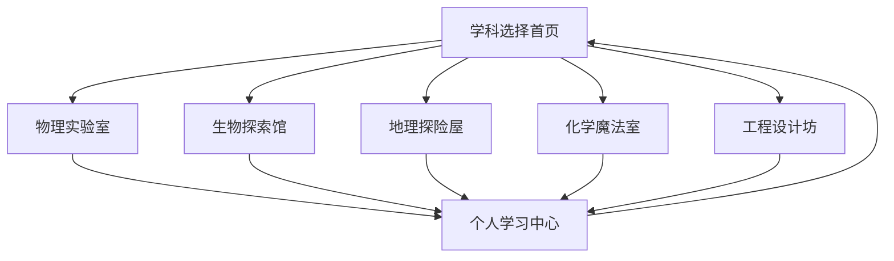

## 1. 产品概述
小学科学教育集成系统是一个专为小学生设计的虚拟仿真游戏化学习平台，通过交互式动画和3D仿真技术，让科学学习变得生动有趣。

- 解决传统科学教育抽象难懂的问题，提供沉浸式学习体验
- 目标用户为6-12岁小学生，通过游戏化方式激发科学兴趣
- 市场价值：填补国内小学科学教育数字化资源的空白，提升科学素养教育质量

## 2. 核心功能

### 2.1 用户角色
| 角色 | 注册方式 | 核心权限 |
|------|----------|----------|
| 学生用户 | 学校统一注册/家长手机号注册 | 访问所有学科内容、完成实验、获得成就 |
| 教师用户 | 学校认证注册 | 创建班级、布置作业、查看学生进度 |
| 家长用户 | 手机号注册 | 查看孩子学习进度、设置学习时间 |

### 2.2 功能模块
我们的科学教育系统包含以下核心页面：
1. **学科选择首页**：展示五大科学学科入口，学习进度概览
2. **物理实验室**：力学、光学、电学等物理现象的3D仿真
3. **生物探索馆**：细胞结构、生态系统、人体器官的交互式学习
4. **地理探险屋**：地球结构、气候变化、地质作用的虚拟体验
5. **化学魔法室**：元素周期表、化学反应的安全模拟实验
6. **工程设计坊**：简单机械、结构设计、创新制作的设计工具
7. **个人学习中心**：学习记录、成就徽章、知识图谱

### 2.3 页面详情
| 页面名称 | 模块名称 | 功能描述 |
|----------|----------|----------|
| 学科选择首页 | 学科导航区 | 展示物理、生物、地理、化学、工程五大图标，点击进入对应学科 |
| 学科选择首页 | 学习进度概览 | 显示各学科完成度、获得徽章、学习时长统计 |
| 学科选择首页 | 推荐内容 | 根据年龄和兴趣推荐适合的实验和课程 |
| 物理实验室 | 力学实验区 | 模拟重力、摩擦力、弹力等物理现象，可调整参数观察变化 |
| 物理实验室 | 光学实验区 | 光的反射、折射、色散实验，支持光源和镜面调整 |
| 物理实验室 | 电学实验区 | 电路搭建、电流电压测试，包含安全用电教育 |
| 生物探索馆 | 微观世界 | 细胞结构3D展示，支持放大缩小观察细胞器 |
| 生物探索馆 | 生态系统 | 森林、海洋、沙漠等生态系统的食物链模拟 |
| 生物探索馆 | 人体奥秘 | 骨骼、肌肉、器官系统的交互式探索 |
| 地理探险屋 | 地球内部 | 地核、地幔、地壳的层次结构可视化 |
| 地理探险屋 | 天气工厂 | 模拟降雨、降雪、台风等天气现象的形成 |
| 地理探险屋 | 地质变迁 | 火山爆发、地震、板块运动的动态演示 |
| 化学魔法室 | 元素周期表 | 交互式元素周期表，点击查看元素特性和应用 |
| 化学魔法室 | 反应实验室 | 安全模拟酸碱反应、氧化还原等常见化学反应 |
| 化学魔法室 | 分子构建 | 拖拽原子构建分子，观察分子结构 |
| 工程设计坊 | 简单机械 | 杠杆、滑轮、斜面等机械的组装和测试 |
| 工程设计坊 | 结构挑战 | 桥梁、塔楼等结构的稳定性测试游戏 |
| 工程设计坊 | 创意工坊 | 自由设计工具，培养创新思维和动手能力 |
| 个人学习中心 | 学习记录 | 详细记录各学科学习时间、完成实验次数 |
| 个人学习中心 | 成就系统 | 徽章收集、等级提升、学习里程碑展示 |
| 个人学习中心 | 知识图谱 | 可视化展示已掌握知识点和学习路径 |

## 3. 核心流程

### 学生用户流程
1. 登录系统后进入学科选择首页，可以查看总体学习进度
2. 选择感兴趣的学科进入对应的虚拟实验室
3. 在实验室中选择具体的实验项目进行交互式学习
4. 完成实验后获得知识点讲解和成就徽章
5. 在个人学习中心查看学习成果和知识掌握情况

### 教师用户流程
1. 登录教师账户，创建班级并添加学生
2. 选择教学内容，布置实验任务给指定班级
3. 查看学生完成情况和知识点掌握程度
4. 根据数据反馈调整教学策略

## 4. 用户界面设计

### 4.1 设计风格
- **主色调**：明亮活泼的蓝色(#4A90E2)作为主色，橙色(#FF6B35)作为强调色
- **辅助色**：绿色(#7ED321)表示成功，红色(#D0021B)表示警告
- **按钮风格**：圆润的3D按钮设计，带有阴影效果，增强点击感
- **字体选择**：圆体或手写风格字体，字号较大(16-20px)便于儿童阅读
- **图标风格**：扁平化卡通风格，色彩鲜艳，形象生动

### 4.2 页面设计概览
| 页面名称 | 模块名称 | UI元素 |
|----------|----------|--------|
| 学科选择首页 | 学科导航区 | 五个大型圆形图标呈弧形排列，带有悬浮动画效果，每个图标有独特的学科吉祥物 |
| 学科选择首页 | 学习进度概览 | 进度条采用彩虹色彩，徽章采用金色星星设计，统计数字使用大号彩色数字 |
| 物理实验室 | 力学实验区 | 3D场景背景，左侧为工具栏，右侧为参数调节面板，底部为实验操作区 |
| 生物探索馆 | 微观世界 | 深色背景模拟显微镜观察，细胞器用不同颜色高亮，支持360度旋转查看 |
| 地理探险屋 | 地球内部 | 半透明地球模型，可逐层剥离显示内部结构，每层用不同颜色区分 |
| 化学魔法室 | 元素周期表 | 彩色方块排列，每个元素有独特图标，点击后有魔法粒子效果 |
| 工程设计坊 | 结构挑战 | 网格化的设计区域，左侧为材料库，右侧为测试工具栏 |
| 个人学习中心 | 成就系统 | 勋章墙设计，收集的徽章在展示柜中排列，未获得的显示为灰色轮廓 |

### 4.3 响应式设计
- **桌面优先**：主要面向平板和电脑端使用，确保大屏幕上的最佳体验
- **移动端适配**：支持基本功能，简化操作界面，适配手机和平板设备
- **触摸优化**：所有交互元素都设计为适合儿童手指操作的尺寸(最小44x44px)

### 4.4 3D场景指导
- **环境设置**：明亮温馨的学习环境，使用柔和的环境光照明
- **光照配置**：主光源模拟自然光，辅助光源增强立体感，避免过暗或过曝
- **相机控制**：支持鼠标拖拽旋转，滚轮缩放，预设最佳观察角度
- **交互反馈**：悬停高亮、点击粒子效果、完成实验的庆祝动画
- **性能优化**：模型面数控制在合理范围，使用LOD技术确保流畅运行