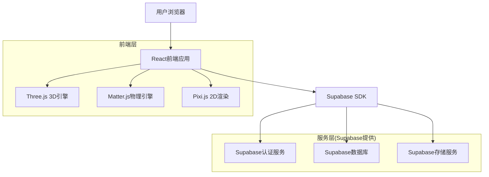

## 1. 架构设计



## 2. 技术描述

- **前端框架**: React@18 + TypeScript + Vite
- **3D渲染**: Three.js + @react-three/fiber + @react-three/drei
- **物理引擎**: Matter.js(用于2D物理仿真)
- **2D渲染**: Pixi.js(用于复杂2D动画效果)
- **状态管理**: Zustand(轻量级状态管理)
- **UI组件**: Tailwind CSS + Headless UI
- **动画库**: Framer Motion(流畅的交互动画)
- **初始化工具**: vite-init
- **后端服务**: Supabase(认证、数据库、文件存储)
- **部署平台**: Vercel/Netlify(前端) + Supabase(后端)

## 3. 路由定义

| 路由路径 | 功能描述 |
|----------|----------|
| / | 学科选择首页，展示五大科学学科入口 |
| /physics | 物理实验室，包含力学、光学、电学等实验 |
| /biology | 生物探索馆，细胞结构、生态系统等学习 |
| /geography | 地理探险屋，地球结构、天气现象等体验 |
| /chemistry | 化学魔法室，元素周期表、化学反应模拟 |
| /engineering | 工程设计坊，简单机械、结构设计工具 |
| /profile | 个人学习中心，学习记录和成就展示 |
| /login | 用户登录页面，支持学生和教师登录 |
| /teacher | 教师管理后台，班级管理和作业布置 |

## 4. 数据模型

### 4.1 数据库实体关系图

```mermaid
erDiagram
  USERS ||--o{ LEARNING_PROGRESS : has
  USERS ||--o{ ACHIEVEMENTS : earns
  USERS ||--o{ EXPERIMENT_RECORDS : completes
  SUBJECTS ||--o{ EXPERIMENTS : contains
  EXPERIMENTS ||--o{ EXPERIMENT_RECORDS : generates
  CLASSES ||--o{ USER_CLASSES : contains
  USERS ||--o{ USER_CLASSES : belongs

  USERS {
    uuid id PK
    string email UK
    string password_hash
    string name
    string role
    integer age
    string school
    timestamp created_at
    timestamp updated_at
  }

  SUBJECTS {
    uuid id PK
    string name
    string description
    string icon_url
    integer difficulty_level
    timestamp created_at
  }

  EXPERIMENTS {
    uuid id PK
    uuid subject_id FK
    string title
    string description
    json parameters
    json expected_outcome
    integer duration_minutes
    integer difficulty_level
    timestamp created_at
  }

  LEARNING_PROGRESS {
    uuid id PK
    uuid user_id FK
    uuid subject_id FK
    integer completion_percentage
    integer total_time_minutes
    timestamp last_accessed
    timestamp created_at
  }

  EXPERIMENT_RECORDS {
    uuid id PK
    uuid user_id FK
    uuid experiment_id FK
    json parameters_used
    json actual_outcome
    boolean is_completed
    integer score
    integer time_spent_minutes
    timestamp created_at
  }

  ACHIEVEMENTS {
    uuid