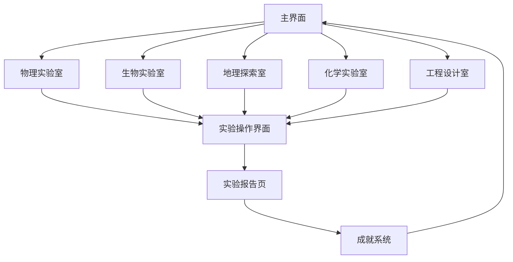

## 1. 产品概述
小学科学虚拟仿真实验室是一个集成化的教育游戏平台，通过真实的虚拟仿真和交互动画，让小学生在游戏化环境中学习物理、生物、地理、化学和工程设计知识。

产品解决传统科学教育抽象难懂的问题，为6-12岁学生提供沉浸式学习体验，提升科学学习兴趣和效果。

## 2. 核心功能

### 2.1 用户角色
| 角色 | 注册方式 | 核心权限 |
|------|----------|----------|
| 学生用户 | 学校统一注册或家长手机号注册 | 访问所有学科实验、完成实验任务、获得成就 |
| 教师用户 | 学校管理员创建账号 | 管理班级学生、分配实验任务、查看学习报告 |
| 家长用户 | 手机号注册绑定孩子账号 | 查看孩子学习进度、接收学习报告 |

### 2.2 功能模块
产品包含以下核心页面：
1. **主界面**：学科选择入口、学习进度展示、成就系统、个人中心
2. **物理实验室**：力学实验、光学实验、电学实验、热学实验
3. **生物实验室**：植物生长观察、动物解剖仿真、生态系统模拟
4. **地理探索室**：地形地貌模拟、天气现象仿真、地质构造实验
5. **化学实验室**：元素周期表互动、化学反应模拟、分子结构搭建
6. **工程设计室**：简单机械设计、桥梁建造、电路设计
7. **实验报告页**：实验结果记录、知识点总结、错题回顾

### 2.3 页面详情
| 页面名称 | 模块名称 | 功能描述 |
|-----------|-------------|-------------|
| 主界面 | 学科入口 | 展示五个学科图标，点击进入对应实验室 |
| 主界面 | 学习进度 | 显示各学科完成度和总体学习时长 |
| 主界面 | 成就系统 | 展示获得的徽章、积分和排行榜 |
| 物理实验室 | 力学仿真 | 模拟重力、摩擦力、弹力等物理现象 |
| 物理实验室 | 光学实验 | 光的反射、折射、色散现象模拟 |
| 生物实验室 | 植物生长 | 观察种子发芽、生长过程的时间加速模拟 |
| 生物实验室 | 动物解剖 | 3D虚拟解剖，展示内部器官结构 |
| 地理探索室 | 地形模拟 | 火山喷发、地震、板块运动仿真 |
| 地理探索室 | 天气系统 | 模拟雨、雪、雷电等天气现象形成 |
| 化学实验室 | 元素周期表 | 交互式元素展示，点击查看详细信息 |
| 化学实验室 | 反应模拟 | 虚拟化学实验，观察反应过程和结果 |
| 工程设计室 | 机械设计 | 搭建滑轮、杠杆等简单机械装置 |
| 工程设计室 | 桥梁建造 | 设计并测试桥梁承重能力 |
| 实验报告页 | 结果记录 | 自动生成实验数据和结论 |
| 实验报告页 | 知识总结 | 提取实验中涉及的科学知识点 |

## 3. 核心流程
学生用户操作流程：
1. 登录系统后进入主界面，查看各学科学习进度
2. 选择感兴趣的学科图标进入对应实验室
3. 在实验列表中选择具体实验项目
4. 通过拖拽、点击等方式与虚拟实验器材互动
5. 观察实验现象，记录实验数据
6. 完成实验后查看实验报告和知识点总结
7. 获得成就徽章和积分奖励

教师用户操作流程：
1. 登录教师账号进入教师管理界面
2. 创建班级并添加学生账号
3. 为不同学生分配适合的实验任务
4. 查看学生实验完成情况和成绩统计
5. 导出学习报告用于教学分析

## 4. 用户界面设计

### 4.1 设计风格
- **主色调**：明亮的天蓝色(#4A90E2)和草绿色(#7ED321)，营造科学探索的清新感
- **辅助色**：橙色(#F5A623)用于强调和警告，紫色(#9013FE)用于神秘科学现象
- **按钮样式**：圆角矩形，3D立体效果，悬停时有弹跳动画
- **字体**：主标题使用思源黑体，正文使用幼圆体，字号24-32px适合儿童阅读
- **图标风格**：扁平化设计配合简单线条，使用科学相关的emoji和图标
- **布局风格**：卡片式布局，每个学科独立成卡片，带有悬浮效果

### 4.2 页面设计概述
| 页面名称 | 模块名称 | UI元素 |
|-----------|-------------|-------------|
| 主界面 | 学科入口 | 五个圆形图标排成花朵形状，每个图标有独特的颜色和动画效果 |
| 实验界面 | 3D场景区 | 占据70%屏幕空间，左侧为实验器材架，右侧为操作面板 |
| 实验界面 | 操作面板 | 底部弹出式设计，包含实验步骤提示和数据显示 |
| 实验报告 | 数据展示 | 使用图表和动画展示实验结果，支持截图保存 |
| 成就页面 | 徽章墙 | 3D旋转展示柜，展示获得的徽章和奖杯 |

### 4.3 响应式设计
- **桌面端优先**：主要针对学校电脑室和家用电脑优化
- **平板适配**：支持10英寸以上平板，触控操作优化
- **手机简化**：仅支持查看学习报告和成就，不支持复杂实验操作
- **触控优化**：按钮大小不小于48px，支持多点触控手势

### 4.4 3D场景指导
- **环境设置**：使用明亮的HDR环境贴图，营造实验室干净明亮的感觉
- **光照系统**：主光源模拟实验室顶灯，补光确保实验器材清晰可见
- **相机控制**：支持360度环绕观察，默认45度俯视角便于操作
- **交互反馈**：鼠标悬停时器材发光，拖拽时有粒子效果
- **动画系统**：实验现象使用流畅的物理动画，如液体流动、光线传播等
- **性能优化**：3D模型使用GLB格式，纹理大小控制在512px以内