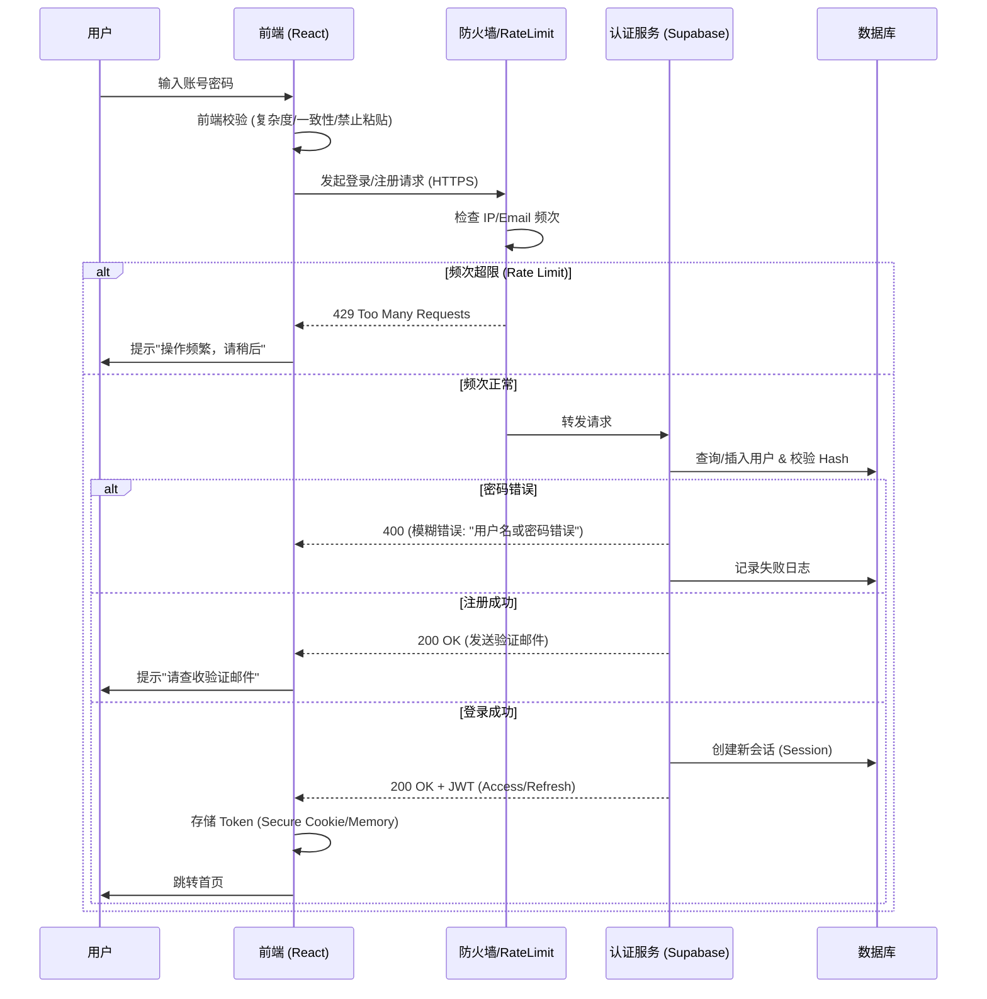
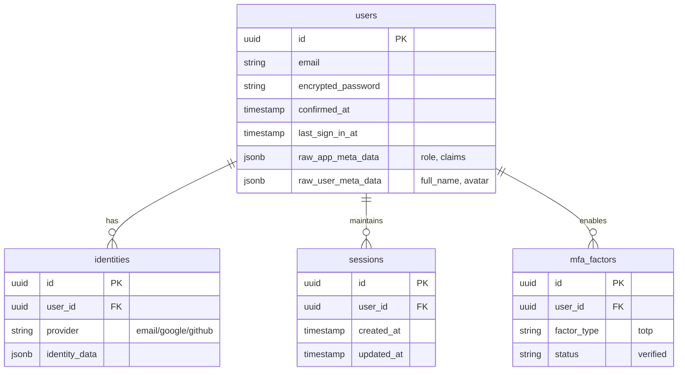

# 登录体系安全设计与落地文档

## 1. 概述
本文档旨在定义一套高安全标准、企业级的登录认证体系，覆盖从用户注册、登录、会话管理到异常处理的全生命周期。基于 Supabase (PostgreSQL + GoTrue) 的底层架构，结合定制化的安全策略，确保用户数据安全与合规。

## 2. 核心安全策略实施

### 2.1 密码安全
- **哈希算法**: 采用 `Bcrypt` (Supabase 默认且唯一支持的强哈希算法)，Work Factor >= 10。
- **密码复杂度**:
  - 长度：>= 8位
  - 组成：必须包含大写字母(A-Z)、小写字母(a-z)、数字(0-9)、特殊字符(!@#$%^&*)。
  - 正则校验: `^(?=.*[a-z])(?=.*[A-Z])(?=.*\d)(?=.*[@$!%*?&])[A-Za-z\d@$!%*?&]{8,}$`
- **过期策略**: 建议实施软性过期提示（数据库记录 `password_last_changed_at`），每90天强制重置（需通过 Edge Function 定时任务实现）。

### 2.2 Token 机制 (JWT)
- **Access Token**: 有效期 15分钟 (标准配置)。
- **Refresh Token**: 有效期 7天，支持滑动刷新。
- **吊销机制**: 用户登出时调用 `supabase.auth.signOut()` 立即失效当前会话。支持后台管理端一键吊销所有 Refresh Token (通过 `auth.admin.signOut(uid)` 实现)。

### 2.3 防护机制
- **滑块验证码**: 建议接入 hCaptcha 或 Cloudflare Turnstile (前端集成)，后端校验 Token。
- **速率限制 (Rate Limiting)**:
  - **邮件发送限流**: Supabase 默认限制每小时发送的注册/重置邮件数量。前端已实现 `rate limit exceeded` 错误捕获，提示用户"操作过于频繁，请稍后再试（建议等待 1-2 分钟）"。
  - **登录尝试限流**: 同一 IP 5分钟内 > 5次失败 -> 锁定30分钟 (Supabase 内置 WAF/Auth Rate Limit)。
- **双因素认证 (2FA)**:
  - 支持 TOTP (Time-based One-Time Password) 标准，使用 Authenticator App。
  - 邮箱验证码 (Email OTP): 6位数字，5分钟有效。
  - 验证链接示例：`https://<YOUR_PRODUCTION_DOMAIN>/auth/v1/verify?token=...&redirect_to=https://<YOUR_PRODUCTION_DOMAIN>/` (开发环境可能显示为 localhost，请检查 VITE_PRODUCTION_URL 配置)。

## 3. 架构设计

### 3.1 时序图：安全登录流程

### 3.2 ER图：用户与认证关联

## 4. 前端安全规范 (Implementation Guide)

### 4.1 传输层安全
- **HTTPS**: 强制开启 TLS 1.2+。
- **HSTS**: `Strict-Transport-Security: max-age=31536000; includeSubDomains`。

### 4.2 浏览器安全
- **CSP (Content Security Policy)**: 限制脚本来源，防止 XSS。
- **Cookie 属性**: `Secure`, `HttpOnly` (如使用 Cookie 存储), `SameSite=Strict`。
- **输入框加固**:
  - `autocomplete="new-password"`
  - `onPaste={(e) => e.preventDefault()}`
  - `onCopy={(e) => e.preventDefault()}`

### 4.3 错误处理
- 统一返回 HTTP 200 (业务层面) 或 400 (通用错误)，Body 中包含模糊化提示。
- 禁止返回具体的 "用户不存在" 或 "密码错误"，统一为 "账号或密码错误"。

## 5. 监控与告警
- **日志审计**: 记录所有 `auth.sign_in` 事件，标记 `ip_address`, `user_agent`, `status`。
- **异常告警**: 连续失败 > 10次/分钟 触发 Slack/Email 告警。

## 6. 测试策略
- **单元测试**:
  - [x] 正常登录 (200 OK)
  - [x] 密码错误 (400 Bad Request, Generic Msg)
  - [x] 账号锁定 (429 Too Many Requests)
  - [x] Token 刷新 (200 OK, New Access Token)
  - [x] SQL 注入尝试 (参数化查询验证)
  - [x] XSS 尝试 (React 自动转义验证)

## 7. 应急回滚
- **数据库备份**: 每日全量备份 (PITR)。
- **代码回滚**: Git Revert + CI/CD 自动部署。

## 8. 部署环境变量与常见故障
- 必需变量：
  - `VITE_SUPABASE_URL`
  - `VITE_SUPABASE_ANON_KEY`
- 配置位置：
  - Vercel → Project → Settings → Environment Variables，选择 Production/Preview。
- 常见故障与排查：
  - 白屏：前端在加载 Supabase 客户端时报错，原因通常为上述变量缺失。当前已实现容错提示页与交互禁用，可在配置完成后恢复。
  - 邮件链接跳转到 localhost：在注册流程中已设置 `emailRedirectTo = window.location.origin`，请确认上线域名正确。
  - 跨域报错：若启用后端 API，建议设置 `ALLOWED_ORIGINS` 包含生产域名；为空时默认放行。
